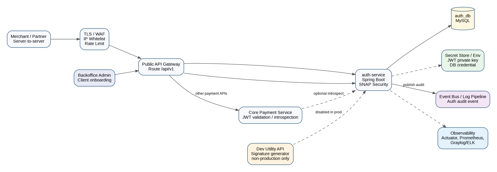
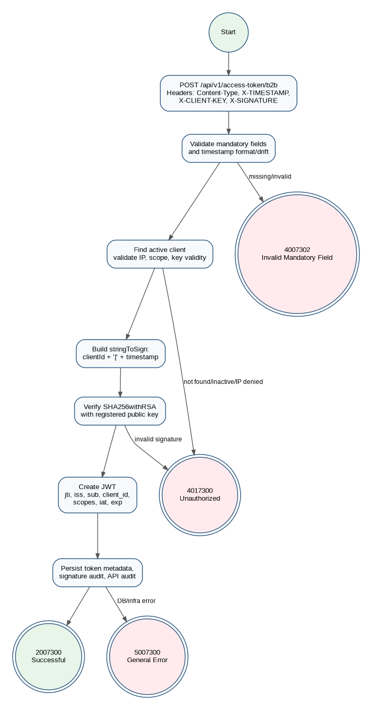
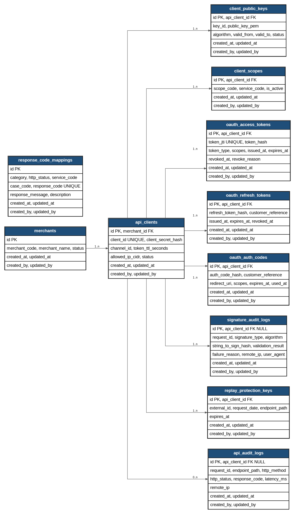

# Auth Service

Production-like Spring Boot auth-service for a SNAP-style payment platform portfolio. The service focuses on partner authentication, RSA signature verification, B2B access-token issuance, internal token introspection, auditability, and observability.

Reference documents:

- [PRD and Technical Design](docs/PRD_Auth_Service_SNAP_Keamanan.docx)
- [Architecture diagram](docs/images/architecture.png)
- [Access-token flow diagram](docs/images/flow.png)
- [ERD diagram](docs/images/erd.png)
- [ASPI SNAP Keamanan](https://apidevportal.aspi-indonesia.or.id/api-services/keamanan)

## Problem Statement

Payment APIs cannot rely only on a static client id or network trust. A partner needs to prove request ownership before receiving a bearer token, and the platform needs a consistent way to reject invalid clients, expired keys, bad signatures, replay-like requests, and infrastructure failures.

This auth-service models that boundary. It validates `X-CLIENT-KEY`, `X-TIMESTAMP`, and `X-SIGNATURE`, verifies `SHA256withRSA` signatures using a registered partner public key, issues short-lived JWT bearer tokens, stores token metadata for introspection/revocation, and writes audit logs without storing raw tokens, private keys, or raw signatures.

The portfolio value is intentionally backend-heavy: payment security, deterministic business logic, database-backed audit trails, production-like Docker packaging, test coverage, OpenAPI documentation, and manual Postman verification.

## Scope MVP

Implemented:

- SNAP Access Token B2B endpoint with `client_credentials` grant.
- RSA `SHA256withRSA` auth signature verification over `clientId|X-TIMESTAMP`.
- Client status, public-key validity, IP policy, active-scope, and timestamp validation.
- JWT bearer token issuance with token metadata persistence.
- Internal token introspection endpoint.
- Internal signature verification endpoint.
- API audit log and signature audit log.
- SNAP response-code mapping for service code `73`.
- Flyway-managed MySQL schema and seed data.
- Unit tests, Testcontainers MySQL integration tests, Postman collection, OpenAPI, Prometheus metrics, and Docker Compose.

Out of scope for the MVP:

- Core payment transaction processing.
- Production dashboard for client onboarding and key rotation.
- Complete B2B2C authorization-code and refresh-token flow.
- Distributed rate limiting and replay cache backed by Redis.
- Replacing API Gateway, WAF, TLS termination, or external secret management.

## Tech Stack

| Area | Technology |
| --- | --- |
| Language/runtime | Java 21 |
| Framework | Spring Boot 3.5, Spring MVC |
| Security | Spring Security, OAuth2 Resource Server, Nimbus JOSE/JWT |
| Persistence | Spring Data JPA, MySQL 8 |
| Migration | Flyway |
| API docs | Springdoc OpenAPI / Swagger UI |
| Observability | Spring Boot Actuator, Micrometer, Prometheus |
| Tests | JUnit 5, Mockito, Spring Security Test, Testcontainers MySQL |
| Packaging | Multi-stage Dockerfile, Docker Compose |

## Architecture Overview



The service is designed to sit behind an API Gateway/WAF. The gateway handles perimeter concerns such as TLS, routing, IP allowlisting, and rate limits. Auth-service handles the application security boundary: partner credential lookup, signature verification, token issuance, audit logging, and internal validation APIs.

Runtime dependencies are intentionally explicit:

- MySQL stores merchant/client configuration, public keys, scopes, token metadata, response-code mappings, and audit logs.
- Runtime secrets such as DB password and JWT private key are supplied by environment variables or secret manager integration.
- Observability is exposed through Actuator and Prometheus.
- The local/dev signature utility exists only for manual testing and must not be enabled in production.

## SNAP Access Token B2B Flow



1. Partner calls `POST /cashup/v1.0/access-token/b2b`.
2. Service validates mandatory headers, JSON body, `Content-Type`, `grantType=client_credentials`, and timestamp freshness.
3. Service loads the active client by `X-CLIENT-KEY`.
4. Service checks client status, allowed IP, active scopes, and active public key validity window.
5. Service builds the string to sign: `clientId|X-TIMESTAMP`.
6. Service verifies `X-SIGNATURE` using `SHA256withRSA` and the stored public key.
7. Service issues a JWT bearer token with `jti`, issuer, subject/client id, merchant code, channel id, scopes, `iat`, and `exp`.
8. Service persists token metadata, signature audit, and API audit rows.
9. Service returns `responseCode=2007300`, `tokenType=Bearer`, and `expiresIn=900`.

## Data Model Summary



| Table | Purpose |
| --- | --- |
| `merchants` | Merchant or partner owner metadata. |
| `api_clients` | Logical client credential, status, channel id, token TTL, and IP policy. |
| `client_public_keys` | Partner public keys with algorithm, key id, validity range, and status. |
| `client_scopes` | Active authorization scopes per client. |
| `oauth_access_tokens` | Issued token metadata: JTI, token hash, scopes, issued time, expiry, revocation status. |
| `signature_audit_logs` | Signature validation result with hashed string-to-sign and failure reason. |
| `api_audit_logs` | Request/response audit with endpoint, HTTP status, SNAP response code, latency, and remote IP. |
| `response_code_mappings` | SNAP response-code catalog used by the response mapper. |

The schema also includes future-facing tables for B2B2C auth codes, refresh tokens, and replay protection keys. These are present to keep the data model extensible, but the current MVP focuses on B2B token issuance.

## API Endpoints

| Endpoint | Method | Audience | Purpose |
| --- | --- | --- | --- |
| `/cashup/v1.0/access-token/b2b` | `POST` | Partner via gateway | Issue SNAP B2B bearer token. |
| `/internal/v1.0/tokens/introspect` | `POST` | Internal service | Validate an issued access token. Requires `X-INTERNAL-API-KEY`. |
| `/internal/v1.0/signatures/verify` | `POST` | Internal service | Verify SNAP signature material. Requires `X-INTERNAL-API-KEY`. |
| `/cashup/v1.0/utilities/signature-auth` | `POST` | Local/dev only | Generate auth signature for Postman/manual testing. |
| `/actuator/health` | `GET` | Ops | Health/readiness reference. |
| `/actuator/prometheus` | `GET` | Ops | Prometheus metrics. |
| `/swagger-ui.html` | `GET` | Developer/reviewer | Swagger UI. |
| `/v3/api-docs` | `GET` | Developer/reviewer | Raw OpenAPI JSON. |

## Sample Access Token Request

Headers:

```http
POST /cashup/v1.0/access-token/b2b HTTP/1.1
Content-Type: application/json
X-TIMESTAMP: 2026-05-12T10:15:30+07:00
X-CLIENT-KEY: 962489e9-de5d-4eb7-92a4-b07d44d64bf4
X-SIGNATURE: base64-rsa-signature-placeholder
```

Body:

```json
{
  "grantType": "client_credentials",
  "additionalInfo": {}
}
```

Success response:

```json
{
  "responseCode": "2007300",
  "responseMessage": "Successful",
  "accessToken": "eyJhbGciOiJSUzI1NiJ9.fake-token",
  "tokenType": "Bearer",
  "expiresIn": "900",
  "additionalInfo": {}
}
```

Missing `X-SIGNATURE` response:

```json
{
  "responseCode": "4007302",
  "responseMessage": "Invalid Mandatory Field X-SIGNATURE",
  "additionalInfo": {}
}
```

Invalid signature response:

```json
{
  "responseCode": "4017300",
  "responseMessage": "Unauthorized",
  "additionalInfo": {}
}
```

## Response Code Strategy

SNAP response codes follow this shape: HTTP status code + service code + case code. For Access Token B2B, this service uses service code `73`.

| Scenario | HTTP | Response code | Meaning |
| --- | --- | --- | --- |
| Successful token issuance | `200` | `2007300` | Successful. |
| Invalid field or malformed request | `400` | `4007300` / `4007301` / `4007302` | Bad request or invalid mandatory field. |
| Unknown/inactive client, invalid signature, expired public key, IP denied | `401` | `4017300` | Unauthorized. |
| Expired/invalid token on protected internal validation | `401` | `4017301` | Invalid token. |
| Valid token but insufficient scope | `403` | `4037300` | Forbidden. |
| Duplicate or replay-like request | `409` | `4097300` | Conflict. |
| Database, signing, or unexpected infrastructure error | `500` | `5007300` | General error. |

## Security Notes

- Do not commit real DB credentials, JWT private keys, client secrets, partner private keys, raw bearer tokens, raw signatures, or production `.env` files.
- The repository `.env.example` contains placeholders only. Real values should come from local `.env`, CI secret variables, Docker secrets, or a secret manager.
- Partner private keys are never stored by the service. Only public keys are stored in `client_public_keys`.
- Raw access tokens are not stored in the database. The service stores token JTI and token hash metadata.
- Signature audit logs store a hash of the string-to-sign and failure reason, not the raw signature or partner private key.
- The Postman private key is local test material only. Do not replace it with production private key material.
- `POST /cashup/v1.0/utilities/signature-auth` is for `local`/`dev` profile only and must not be enabled in production.
- Custom metrics intentionally avoid sensitive labels such as token, signature, client secret, request id, IP, and user-agent.

## Run Locally With Maven

Requirements:

- Java 21
- Docker Desktop for local MySQL
- Maven wrapper from this repository

Start MySQL:

```powershell
Copy-Item .env.example .env
docker compose up -d auth-mysql
```

Run the app on port `3031` for Postman/Swagger consistency:

```powershell
$env:JAVA_HOME="C:\Program Files\Eclipse Adoptium\jdk-21.0.9.10-hotspot"
$env:Path="$env:JAVA_HOME\bin;$env:Path"
$env:AUTH_SERVICE_PORT="3031"
$env:SPRING_PROFILES_ACTIVE="local"
$env:AUTH_DB_URL="jdbc:mysql://localhost:3307/auth_db?createDatabaseIfNotExist=true&useSSL=false&allowPublicKeyRetrieval=true&connectionTimeZone=UTC&forceConnectionTimeZoneToSession=true"
$env:AUTH_DB_USERNAME="auth_user"
$env:AUTH_DB_PASSWORD="change-this-auth-password"
$env:AUTH_INTERNAL_API_KEY="change-this-internal-api-key"
$env:AUTH_JWT_PRIVATE_KEY="<paste-local-test-private-key-pem>"
$env:AUTH_JWT_PUBLIC_KEY="<paste-local-test-public-key-pem>"
.\mvnw.cmd spring-boot:run
```

JWT signing requires non-empty `AUTH_JWT_PRIVATE_KEY` and `AUTH_JWT_PUBLIC_KEY` values at runtime. Keep those values out of Git and provide them through local environment variables, local `.env`, Docker secrets, CI secrets, or a secret manager.

Health check:

```powershell
Invoke-WebRequest http://localhost:3031/actuator/health -UseBasicParsing
```

## Run With Docker

Build the production-like image:

```powershell
docker build -t auth-service:local .
```

Run the app and MySQL:

```powershell
Copy-Item .env.example .env
docker compose up --build
```

Before starting Docker Compose, fill `.env` with non-empty `AUTH_JWT_PRIVATE_KEY` and `AUTH_JWT_PUBLIC_KEY` values. Compose marks both variables as required and fails fast when they are missing.

Docker Compose exposes the app at `http://localhost:3031` and connects the container to MySQL through `auth-mysql:3306`. The runtime image runs as a non-root `app` user and does not bake secrets into the image.

## Test With Postman

Import:

- `postman/SNAP_Auth_Service_Postman_Collection.json`
- `postman/SNAP_Auth_Service_Postman_Environment.json`

Select the `SNAP Auth Service - Local` environment. Ensure:

- `base_url=http://localhost:3031`
- `internal_api_key` matches `AUTH_INTERNAL_API_KEY`
- The app runs with `SPRING_PROFILES_ACTIVE=local` or `dev` so the signature utility is available.
- Flyway seed data exists in MySQL.

Run requests in this order:

1. `01 - Health Check`
2. `02 - Dev Utility - Generate Signature Auth`
3. `03 - Access Token B2B - Positive`
4. `04 - Access Token B2B - Negative Invalid Signature`
5. `05 - Access Token B2B - Negative Missing X-SIGNATURE`
6. `06 - Token Introspection - Active`
7. `07 - Token Introspection - Expired or Invalid`
8. `08 - Internal Signature Verify`

The dev utility generates `x_timestamp` and `x_signature_auth`; the positive access-token request stores `access_token` for introspection.

## OpenAPI And Observability

Local URLs when running with Docker Compose:

| Service | URL |
| --- | --- |
| Auth service | `http://localhost:3031` |
| Prometheus | `http://localhost:9090` |
| Grafana | `http://localhost:3000` |

Swagger UI:

```powershell
Start-Process http://localhost:3031/swagger-ui.html
Invoke-WebRequest http://localhost:3031/v3/api-docs -UseBasicParsing
```

Prometheus metrics:

```powershell
Invoke-WebRequest http://localhost:3031/actuator/prometheus -UseBasicParsing
```

Actuator exposes `health`, `info`, `metrics`, and `prometheus` by default. Metrics include the default tag `application=auth-service`.

Docker Compose starts Prometheus with `prometheus.yml`, which scrapes `/actuator/prometheus` from `auth-service:8080` inside the Compose network.

Custom metrics:

```powershell
(Invoke-WebRequest http://localhost:3031/actuator/prometheus -UseBasicParsing).Content |
    Select-String "auth_token_request_success_total|auth_token_request_failure_total|auth_token_invalid_signature_total|auth_token_unauthorized_total|auth_token_request_latency_seconds"
```

## Automated Tests

Unit and lightweight Spring tests:

```powershell
.\mvnw.cmd test
```

Integration tests with Testcontainers MySQL:

```powershell
.\mvnw.cmd verify -Pintegration-test
```

Integration tests require Docker Desktop or CI Docker access. They run Flyway migrations against a disposable MySQL container and verify endpoint behavior plus token/audit persistence.

## Future Improvements

- B2B2C authorization code and refresh token flow.
- Key rotation UI for onboarding and expiring partner public keys safely.
- Redis-backed rate limiter and replay protection for distributed deployments.
- Admin dashboard for merchants, clients, scopes, key lifecycle, audit search, and operational metrics.

## Portfolio Review Notes

This repository is intentionally shaped like a deployable payment-security service rather than a tutorial sample:

- Business rules are covered by unit tests.
- MySQL migrations are validated by Testcontainers integration tests.
- Docker image is multi-stage and non-root.
- Manual testing is documented through Postman and OpenAPI.
- Sensitive material is handled as runtime configuration, not repository content.
